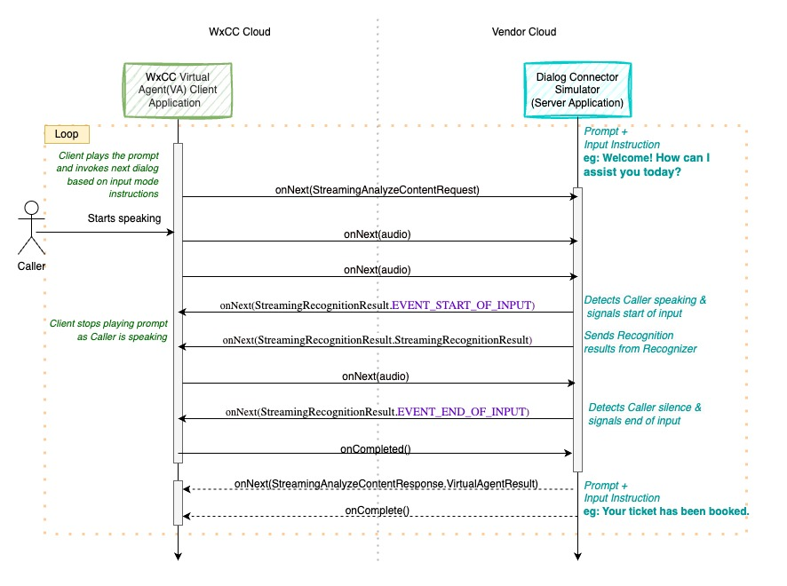
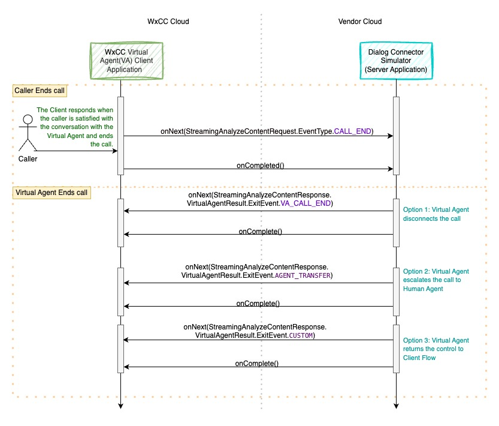

# Dialog Connector Simulator
The Dialog Connector Simulator emulates a dialog connector, enabling end-to-end IVR capabilities. Its functionalities include:
* Media Relay
    * Receiving: Accepts media from the WxCC Virtual Agent (VA) Client Application.
    * Forwarding: Relays received media to an External AI Provider for processing.
    * Returning: Transmits processed media back to the WxCC VA Client Application.

* Service Utilization
    * Based on configuration, it can employ one or multiple service connectors, such as:
        * Text to Speech
        * Speech to Text
        * Natural Language Understanding (NLU)

These connectors provide comprehensive dialog services.

Onboarding is required to use the Dialog Connector Simulator. The Webex Contact Center Control Hub is used to create a configuration. The configuration includes the provider endpoint, services, and authentication token. The configuration is represented by a configId and defines the services and features to be used. The Orchestrator orchestrates the call to a specific provider and adds the necessary feature flags based on the configuration details.

##  Dialog Connector Code Overview
This sample code offers an overview of the various methods and messages used when the Dialog Connector interacts with
the WxCC VA Client Application.

Here,the Dialog Connector represents a **gRPC Server Application** that listens for incoming requests from the
WxCC VA Client Application which is a **gRPC Client Application**.

## Prerequisites for Setting Up the Connector

### Audio Configuration
- Audio Format Supported: _**wav**_
- Audio Sampling Rate: _**16kHz/8KHz**_
- Language: _**en-US**_
- Encoding Format: _**Linear16/ulaw**_
- Please note, we only support wav or raw audio files, 8/16kHz bit rate, single channel

### Authentication
**Coming Soon**: Details about this section will be provided in a future update.

### List Bot API for Dialog Connector Simulator
Each Provider endpoint should implement an API to return a list of configured bots to be used in
Flowbuilder to decide the bot to be used during the call flow with the Customer.
The API should return the list of bots configured in the system.
Refer to the ListVirtualAgents API in the ccai-api.proto file.

### Serviceability
Each Provider endpoint should expose certain APIs to monitor the health of the endpoint. The APIs should return the status of the service.

## Dialog Connector Application Development

### Step 1. Start of Conversation
1. The Dialog Connector will start up as a **gRPC Server Application**.
2. The WxCC Virtual Agent (VA) Client Application will start up as a **gRPC Client** and open a secure gRPC connection with the Server Application.
3. When a caller calls, the Client Application signals to the Dialog Connector to start the conversation by creating a new conversation (`conversation_id`) and sending a `StreamingAnalyzeContentRequest` to the Server Application with `EventType: CALL_START`. The `conversation_id` is used for the entire conversation between the Caller (WxCC VA Client Application) and Virtual Agent (Server Application). The request is sent without any audio data.
4. `EventType: CALL_START` can be used by the connector to start the session with its AI Service and return a response back to the Client using `StreamingAnalyzeContentResponse`. It could contain response payloads, prompts, NLU data, and input mode for handling the next interactions from the Caller. Prompts contain the audio which needs to be played to the Caller. It can return one or multiple prompts in a response. Prompts are played one after another at the client side in the sequence of receiving.

### Step 2. Continue the Conversation Between the Caller and Virtual Agent
1. The Client Application, on receiving the prompt, plays it to the Caller and invokes the next dialog based on the input mode received in the response.
2. **Input Mode** indicates the type of input expected from the Caller. It can be `dtmf` only, `voice` only, or `dtmf_and_voice` both.
    - If the input mode is `dtmf`, the Client Application will wait for the DTMF input from the Caller.
    - If the input mode is `voice`, the Client Application will wait for the voice input from the Caller.
    - If the input mode is `dtmf_and_voice`, the Client Application will start streaming voice input from the Caller.
3. On detecting voice, the Server sends a `StreamingRecognitionResult.EVENT_START_OF_INPUT` to the Client Application to indicate that the Caller is providing voice input and to stop playing the prompt.
4. Once the Caller finishes speaking, the Server detects silence and sends a `StreamingRecognitionResult.EVENT_END_OF_INPUT` to the Client Application to indicate that the Caller has finished speaking.
5. The Server processes the Caller's request and then sends back a `StreamingAnalyzeContentResponse.VirtualAgentResult` to the Client Application with a new set of prompts, NLU data, and input mode for handling the next interactions.

   

### Step 3. Stop the Conversation
1. When the conversation ends between the Caller and Virtual Agent, the Caller can disconnect the call.
    - The Client Application sends a `StreamingAnalyzeContentRequest` to the Server Application with `EventType: CALL_END`.
    - `EventType: CALL_END` can be used by the Server Application to close the session with its AI Service and return a response back to the Client using `StreamingAnalyzeContentResponse`.
2. Similarly, the Virtual Agent can disconnect the call as well using any of the below Exit events as part of `StreamingAnalyzeContentResponse`.
    - **Call End Event**: Sent when the Server Application wants to disconnect the call from the Virtual Agent side.
    - **Agent Transfer Event**: Sent when the Virtual Agent wants to transfer the call to a human agent.
    - **Custom Event**: Sent when the Virtual Agent wants to return control to the calling application flow. It can pass metadata which will contain the context needed for the Client flow.
3. The conversation is complete.
4. The Server Application can close the gRPC connection with the Client Application.

# Glossary
* **Prompts**: The API response will provide the barge-in status of the prompts to be played. Each prompt will indicate if it is barge-in enabled or disabled. The first barge-in enabled prompt in the sequence will make all subsequent prompts barge-in enabled. The Client will play the non-barge-in prompts independently.
* **Prompt Duration**: The Client will also need to set the total duration of barge-in enabled prompts so that the recognizer can wait for this duration.
* **START_OF_SPEECH**: The Client will send the START_OF_SPEECH event to the Server when the user utters a first utterance.
* **Barge-In**: When the Client receives the START_OF_SPEECH event, it will act as an indicator for the Client to barge-in the prompt and continue streaming.
* **Timeout**:  The recognizer will wait for user input based on the timer configured after the prompt finishes. If the user does not provide any input in this duration, the input will time out, resulting in a no-input event.
* **END_OF_SPEECH**: If the user has finished speaking and has taken a pause or has entered all the digits, the Client will receive the END_OF_SPEECH event, indicating to the Client to stop streaming.

