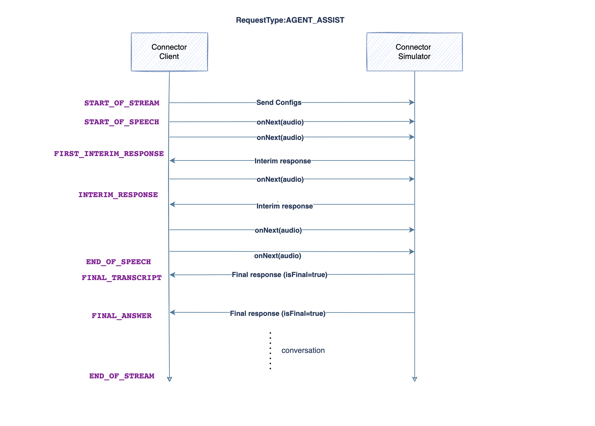

# Dialog Connector Simulator
A Dialog Connector simulator simulates dialog connector and provides an end-to-end IVR capability, it receives media and relay it to external provider for media processing and receives media from service provider, Based on the configuration it can also utilise one or multiple services Connectors such as Text to Speech, Speech to Text, NLU to offer Dialog Service.

# Prerequisites for setting up the API

- Audio Format Supported: _**wav**_
- Audio Sampling Rate: _**16kHz/8KHz**_
- Language: _**en-US**_
- Encoding Format: _**Linear16/ulaw**_

Please note, we only support wav or raw audio files, 8/16kHz bit rate, single channel

## Agent Assist mode
Agent Assist Services leverages the AI services and helps agent handle the customer in more effective way.

## Virtual Agent mode
The Customer interacts with Virtual Agent first which offers the customer a self-service solution, without involving a physical Agent.

  * **Prompts**: The API response will provide the barge-in status of the prompts to be played. Each prompt will indicate if its barge-in enabled / disabled.
  * First Barge-in enabled prompt in the sequence of prompt will make all subsequent prompts barge-in enabled.
  * Client will play the non-barge-in prompts independently.
  * **Prompt Duration**: Client will also need to set the total duration of barge-in enabled prompts so that recognizer can be made waiting for this much long duration.
  * **START_OF_SPEECH**: Client will send the START_OF_SPEECH event to server when user utters a first utterance.
  * **Barge-In**: When client receives START_OF_SPEECH event, it will act as indicator for client to barge-in the prompt and continue the streaming.
  * **Timeout**: Recognizer will wait for user input based on the timer configured after the prompt finish, if user does not provide any input in this duration, the input will time out resulting a no-input event.
  * **END_OF_SPEECH**: If user has finished speaking and has taken a pause or has entered all the digits, client will receive END_OF_SPEECH event which indicates to the client to stop streaming.
  