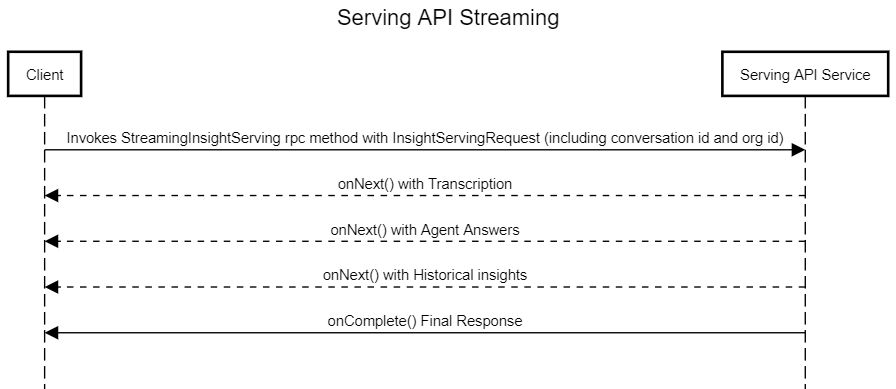

# CCAI Serving API

CCAI Serving API interface is the serving layer to fetch the insights of the call. It can offer the following:
- Historic Insights of IVR Conversation.
- Insights of Caller / Agent Conversation.

CCAI Serving API Service runs a gRPC Server which can be connected from a thick Client by implementing gRPC client or by Browser directly by connecting using grpc-web protocol.

- Serving API gRPC Endpoint: serving-api-streaming.wxcc-_{data-center}_.cisco.com:443
- Serving API HTTP Ping Endpoint: https://serving-api-streaming.wxcc-_{data-center}_.cisco.com/serving-api-streaming/v1/ping

Example: serving-api-streaming.wxcc-us1.cisco.com:443

# Authentication and Authorization

A valid access token generated against the machine account of the org must be passed in the Authorization header and the token should carry a valid scope in it.
Valid scopes : "cjp-ccai:read,cjp:organization"

# Sequence Diagram

# Sample Code
> A sample grpc client implementation based on JavaScript is provided in this repo as a reference. 
